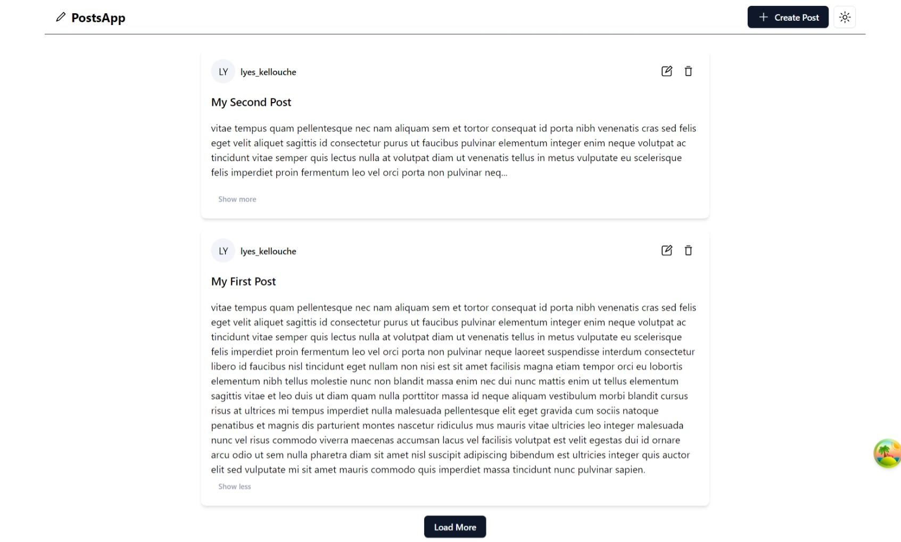
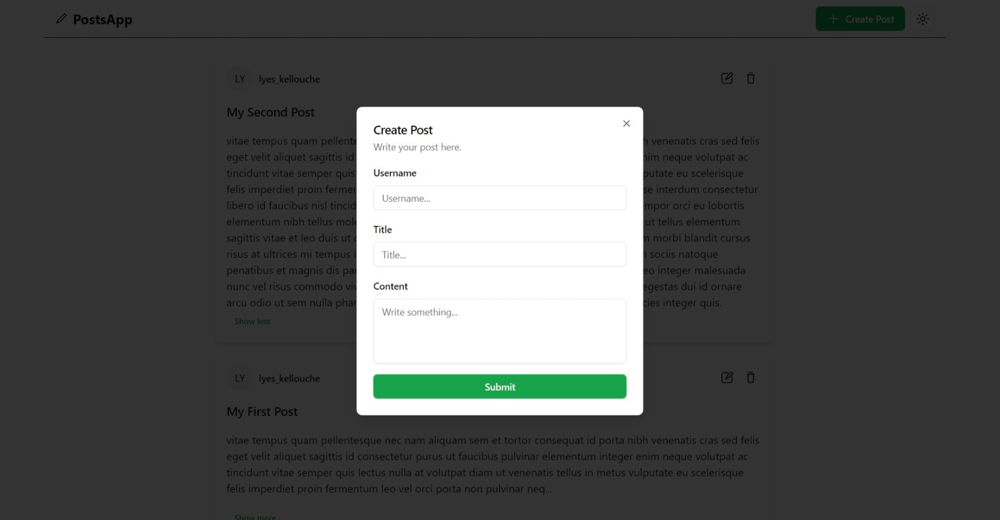
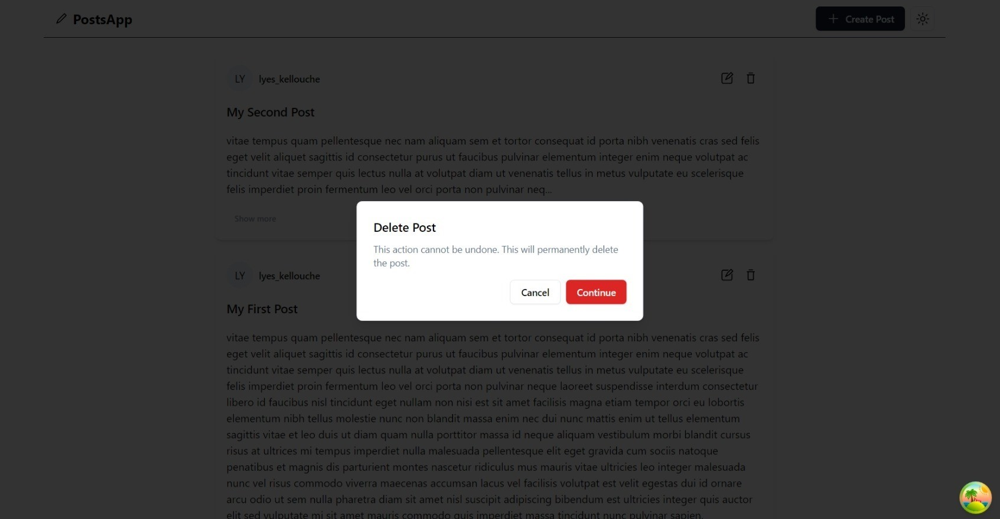
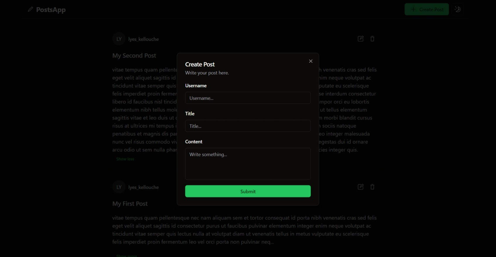
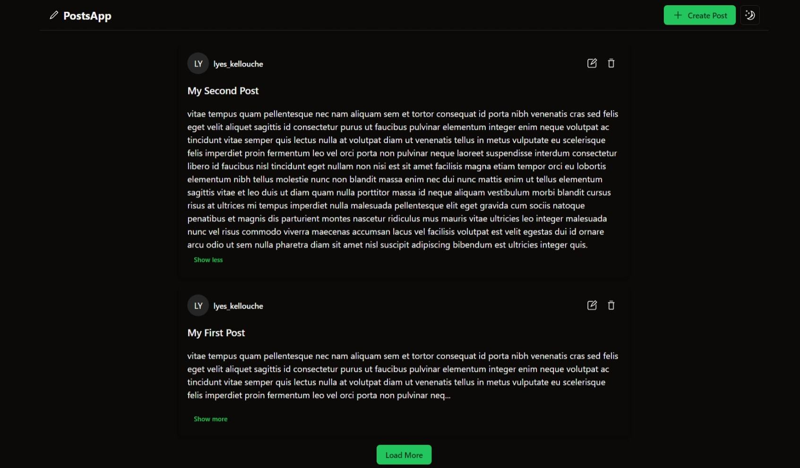
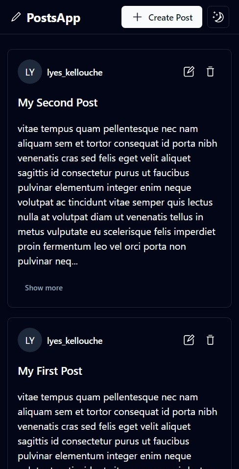

# PostApp

Mini app for writing posts.

### Screenshots

##### Light mode

 

 

##### Dark mode

 

##### Mobile

 

#### Technologies used :

- TypeScript
- React
- shadcn-ui
- React Hook Form
- Zod
- Tailwind
- TanStack Query
- Node
- Express
- MongoDB
- Mongoose
