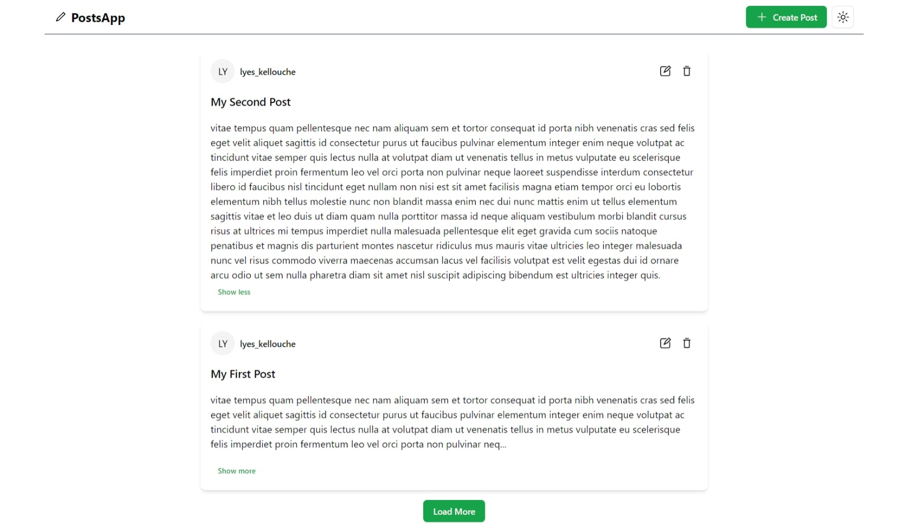
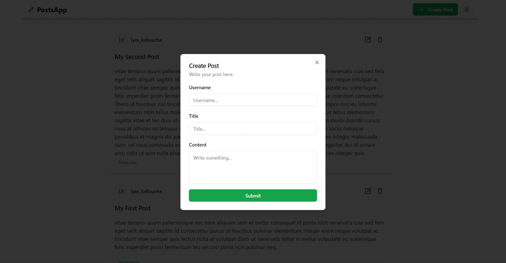
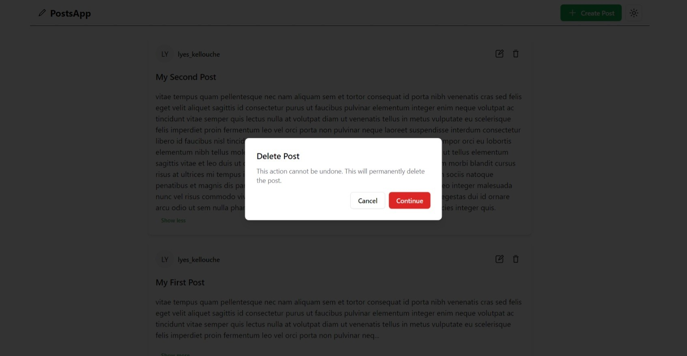
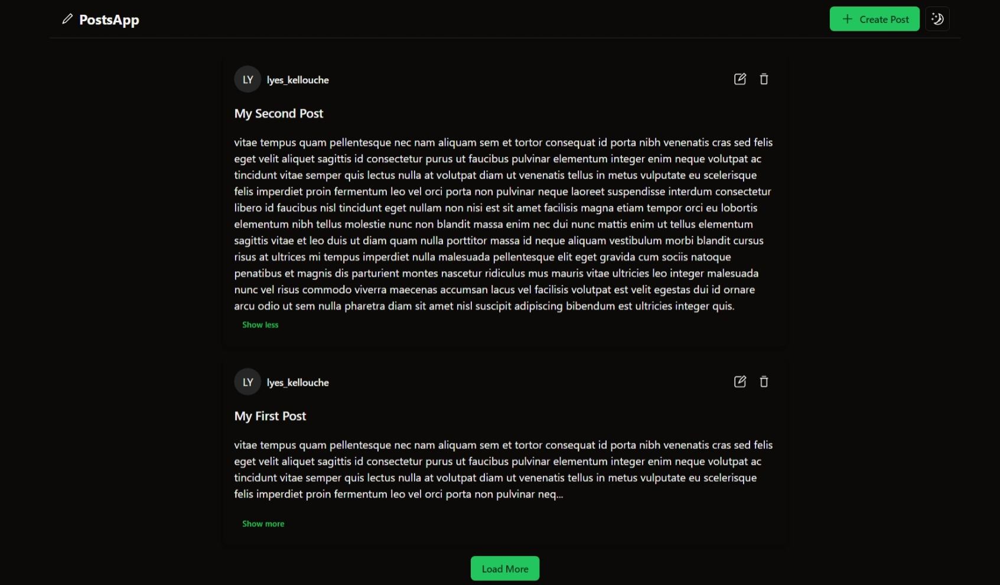
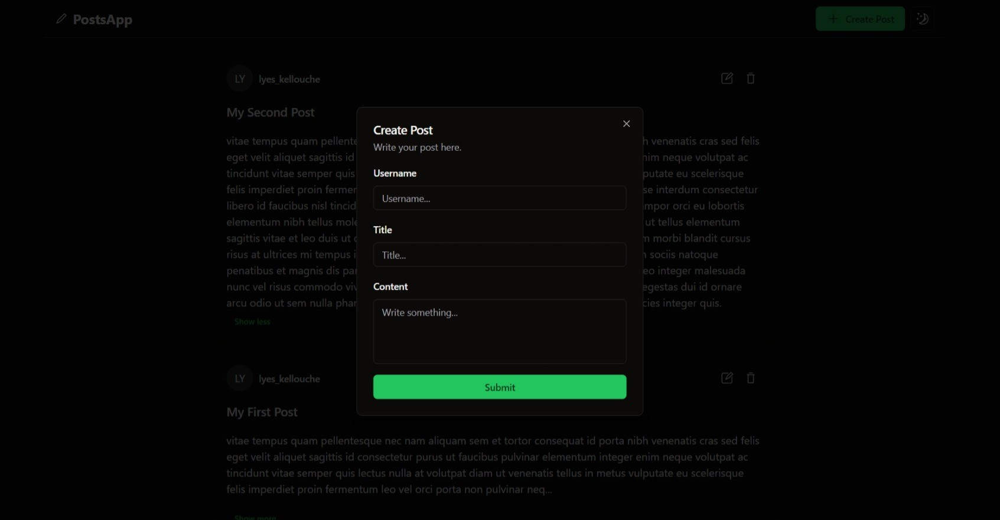
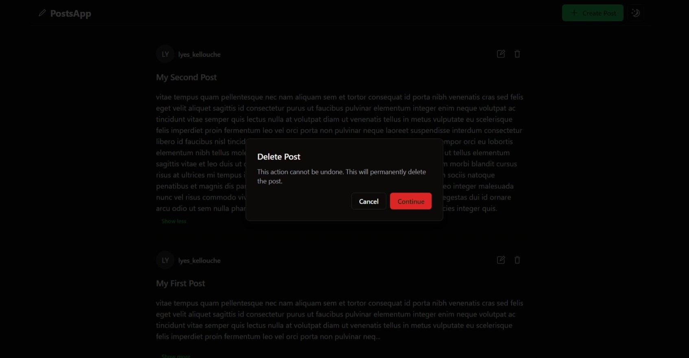
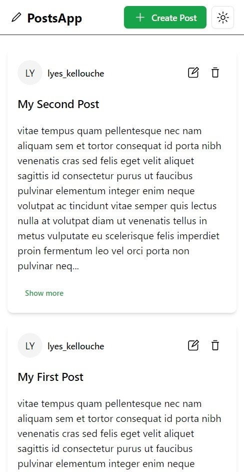
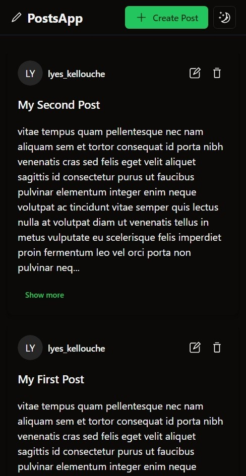

# PostApp

Mini app for writing posts.

### Screenshots

##### Light mode

 

 

##### Dark mode

 

 

##### Mobile

 

#### Tech Stack :

The tools used for this project are probably overkill, but I used them anyway for learning purposes.

The project is organized as a monorepo using [turborepo](https://turbo.build/repo/docs/handbook) and [npm workspace](https://docs.npmjs.com/cli/v8/using-npm/workspaces).

- TypeScript.
- React.
- shadcn-ui.
- React Hook Form.
- Zod.
- Tailwind.
- TanStack Query.
- Node.
- Express.
- MongoDB.
- Mongoose.
